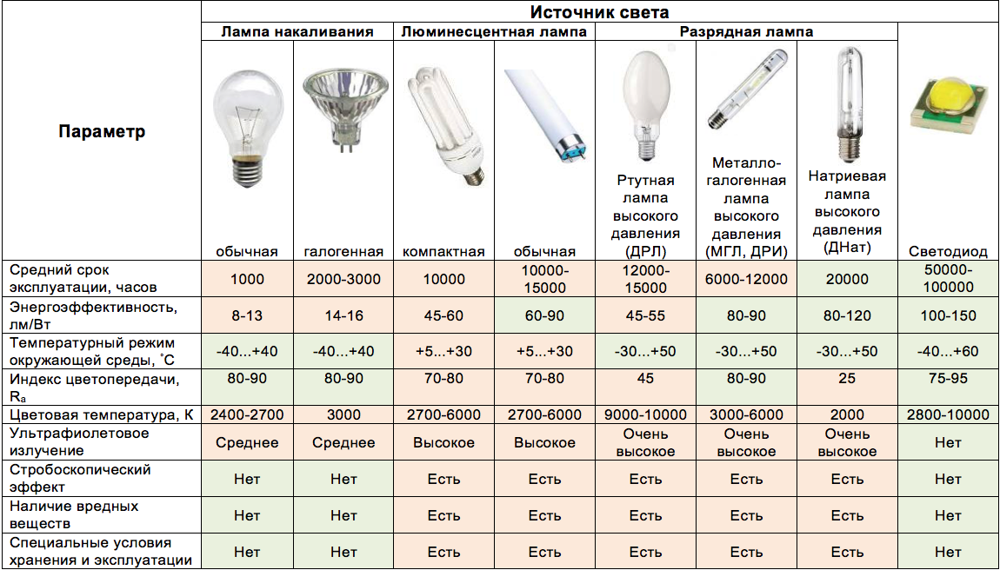
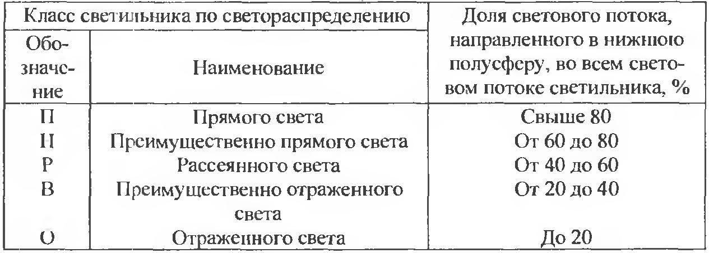
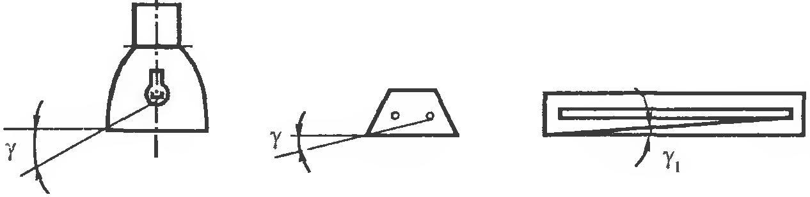

# Источники искусственного света, их характеристики. Осветительные приборы, их характеристики

## Источники света

## Осветительные приборы

В соответствии с ГОСТ 16703-79 световым прибором (СП) называют устройство,
содержащее одну или несколько электрических ламп и светотехническую арматуру,
перераспределяющее свет электрических ламп или преобразующее структуру света и
предназначенное для освещения или сигнализации.

### Виды осветительных приборов

- Светильник – световой прибор ближнего действия;
- Прожектор – световой прибор дальнего действия;
- Проектор - световой прибор перераспределяющий свет лампы с концентрацией
  светового потока на поверхности с малым объемом или в малом объеме.

### Характеристики осветительных приборов

#### Светораспределение

Важнейшей светотехнической характеристикой светильника является
светораспределение, т.е. распределение его светового потока в пространстве. В
зависимости от отношения светового потока, направляемого в нижнюю полусферу, к
полному световому потоку светильники подразделяются на пять классов

#### КПД

Важной светотехнической характеристикой светильника является коэффициент
полезного действия, под которым понимается отношение светового потока
светильника, работающего в данных условиях, к световому потоку установленной в
нем лампы (ламп).

#### Защитный угол светильника

 Защитный угол светильника (γ, γ1 на Figure 3) характеризует зону, в пределах
 которой глаз наблюдателя защищен от прямого действия лампы. Он заключен между
 горизонтальной линией, и касательной к святящемуся телу лампы и к краю
 отражателя или непрозрачного экрана.

