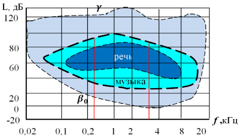

# Характеристика слухового анализатора и влияние шума на организм

Звук – это процесс волнового распространения особого вида механических
колебаний в упругих средах и телах (твердых, жидких, газообразных), способный
вызывать слуховые ощущения (слышимый звук).

## Характеристика слухового анализатора

Анализатор человека воспринимает звук в в диапазоне частот (16 - 20,000) Гц.
Восприятие звука на разных частотах называется областью слышимости и является
основной характеристикой анализатора. На следующем рисунке $\beta_0$ - порог
слышимости, $\gamma$ - болевой порог.

## Влияние шума на организм

В соответствии с документом Международной Организации Труда (ILO) «Защита
трудящихся от шума и вибрации на производстве», шум и вибрация представляют
собой значительные опасности на рабочих местах, наносящие вред здоровью и
работоспособности. Всемирный Совет Здоровья (WHO) определяет здоровье как
полное психическое, физическое и социальное благополучие, что подчеркивает
важность защиты от шумового воздействия.

Особое внимание уделяется повреждениям слуха, вызванным шумом, которые могут
быть необратимыми и приводить к трудностям в восприятии звуковых сигналов, что
увеличивает риск несчастных случаев. Исследования показывают, что даже шум
низкой интенсивности может негативно влиять на кровообращение и общее состояние
организма, вызывая стрессовые реакции и снижая работоспособность.

Выделяют два типа воздействия шума: специфическое (на органы слуха) и
неспецифическое (на весь организм). Длительное воздействие шума может привести
к глухоте, причем заболеваемость среди работников «шумовых» профессий на 10-15%
выше, чем у других. Ограничение вредного влияния шума осуществляется через
нормирование шумовых характеристик и введение предельно допустимых уровней.

Кроме шума, инфра- и ультразвук также оказывают негативное воздействие на
здоровье. Инфразвук может угнетать центральную нервную систему, вызывая
головные боли и нарушения равновесия, в то время как ультразвук приводит к
изменениям в нервной и сердечно-сосудистой системах, а также к быстрой
утомляемости.

