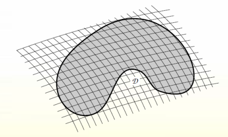

# Двойной и тройной интегралы: определение на языке интегральных сумм Римана. Определение площади и объёма.

$$D=\bigcup_{k=1}^n{D_k},\ D_i\cap D_j=\varnothing\ (i\neq j)$$
Разбиением называется: $\lambda=\{D_1...D_n\}$
Ранг разбиения (т.е. наибольшее из диаметров $D_i,\ D_j$): $|\lambda|= \max\limits_{1\leq i\leq n}D_i$
Составим интегральную сумму Римана: $s(f, \Lambda)=\sum\limits_{i=1}^nf(x, y)S(D_i)$ 