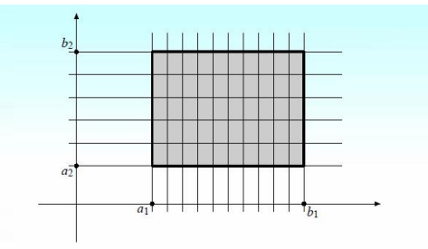

# Определение n-мерного бруса (параллелепипеда) и разбиения бруса.

## Определение

Замкнутый прямоугольный параллепипед или n-мерный интервал 
$D\subset \mathbb{R}^n$ определен условием
$P\{x_1,...,x_n\}\in D\Leftrightarrow a_i\leq x_i\leq b_i, \ i=1,...,\ n\\$
При этом пишут\
$D=[a_1,\ b_1]\times...\times[a_n,\ b_n]$
Такие параллепипеды называются брусами. Объем $V(D)$ бруса определяется
равенством
$V(D)\overset{\text{Опр}}{=}\prod\limits_{i=1}^n 
(b_i-a_i)=(b_1-a_1)\cdot...\cdot(b_n-a_n)$

Разбиением $\alpha$ интервала $[a, b]$ удобно называть множество точек 
$\{t_0, t_1, ..., t_k\}$ таких, что $a=t_0<t_1<...<t_k=b\\$
Множество $\lambda$ действительно делит интервал $[a,b]$ на k интервалов
$[t_{i-1},t_i],\ i=1,...,k$.

## Определение

Разбиением $\lambda$ бруса D называется кортеж 
$\lambda=(\lambda_1,...,\lambda_n)$ одномерных разбиений $\lambda_i$
интервалов $[a_i,b_i]$.
