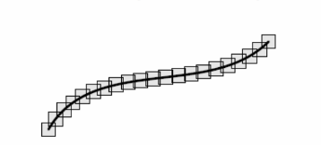

# Множество меры 0. Основные свойства. Примеры.

## Определение1

Множество $A \subset\mathbb{R}^n$ имеет объем-ноль($vol A=0$), если для любого
фиксированного $\varepsilon>0$ существует покрытие множества $A$ брусами 
$B_1....B_k$, суммарный объем которых меньше $\varepsilon:\\$ 
$\\volA \subset 0 \xLeftrightarrow{def} \forall \varepsilon >0 \exists
\bigcup_{j=1}^kB_j \supset A: \\\sum_{j=1}^{k}V(B_j)<\varepsilon$

В этом определении покрытие замкнутыми брусами может быть заменено на открытое
покрытие:

## Лемма

в определении покрытие замкнутыми брусами может быть заменено на открытое
покрытие
$$
vol A=0\Leftrightarrow \forall \varepsilon > 0\exists
\bigcup_{j=1}^k\overset{o}B_j\supset A: \sum_{j=1}^kV(B_J)<\varepsilon,
$$

здесь $\overset{o}B_j-\text{внутренность бруса }B_j,\text{т.е. открытый брус.}$

## Док-во:

Фиксируем $\varepsilon>0$ и пусть

$$\bigcup_{j=1}^kB_j \supset A: \sum_{j=1}^kV(B_j)<\varepsilon/2$$

Пусть брус $C_j$ концентричен брусу $B_j$ и подобен ему с некоторым 
коэффициентом подобия, строго больше единицы (т.е. брус $C_j$ является 
растяжением бруса $B_j$ во всех направлениях), при этом 
$B_j\subset \overset{o}{C_j}$. Коэффициент подобия фиксируем таким чтобы было
выполнено неравенство:

$$V(C_j)\leqslant V(B_j)+\varepsilon/2k$$
Тогда открытые брусы $\overset{o}{C_j}$ покрывают множество $A$, причем
$$
\sum_{j=1}^kV(C_j)\leqslant \sum_{j=1}^kV(B_j)+k\frac{\varepsilon}{2k}<
\frac{\varepsilon}{2}+\frac{\varepsilon}{2}=\varepsilon
$$

## Определение2

Множество $A\subset \mathbb{R}^n$ имеет меру ноль ($mesA=0$), если для любого
фиксированного $\varepsilon > 0$ существует покрытие множества $A$ последовательностью брусов $B_j,j \in \mathbb{N},$ суммарный объем которых меньше $\varepsilon$
$$
mes A=0 \overset{def}\iff \forall \varepsilon > 0 \exists \bigcup_{j=1}^\infty
B_j \supset A :\sum_{j=1}^\infty V(B_j)
$$

## Теорема 

Пусть D - брус  в $\mathbb{R}^n$  Ограниченная функция 
$f:D\rightarrow \mathbb{R},$ множество точек разрыва(I рода) которой имеет объем
ноль, то $f \in R(B)$

## Лемма

Как и в случае объема ноль в определении покрытие замкнутыми брусами может
быть заменено на открытое покрытие
$$
mes A=0\Leftrightarrow \forall \varepsilon > 0
\exists \bigcup_{j=1}^k\overset{o}B_j\supset A:
\sum_{j=1}^kV(B_J)<\varepsilon
$$

## Объединение последовательности множеств меры-ноль если мера ноль:

$$A = \bigcup_{i=1}^\infty A_i,mesA_i=0\Rightarrow mesA=0$$

## Теорема

$]B\subset \mathbb{R}^n-$брус f: $B\rightarrow R$
если множество точек разрыва $f$ имеет меру 0 то $f\in R(B)$
