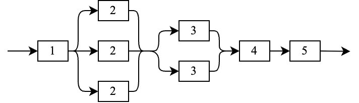
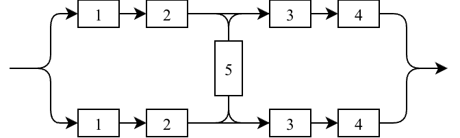

# 17. Расчет показателей надежности. Виды соединений элементов

## Показатели надёжности при эспоненциальном распределении

### Вероятность безотказной работы

$$
    P(t) = e^{-\lambda t}
$$

### Средняя наработка на отказ

$$
    \overline{T} =
    \int_0^{\infty} P(t) dt =
    \int_0^{\infty} e^{-\lambda t} dt =
    \frac{1}{\lambda}
$$

### Гамма-процентная наработка

Нужно приравнять ВБР к требуемой $\gamma$

$$
    P(t)           = \gamma \\
    e^{-\lambda t} = \gamma \\
    t              = - \frac{\ln(\gamma)}{\lambda}
$$

### Коэффициент готовности

Для невосстанавливоемой системы равен ВБР.

$$
    K_г (t) = P(t)
$$

При наличии восстановления ???

### Средний коэффициент готовности

$$
    \overline{K}_г = \frac{1}{t_n} \int_0^{t_n} K_г (t) dt
$$

Для экпоненциального распределения:

$$
    \overline{K}_{г} = \frac{1-P(t_n)}{\lambda t_n}
$$

С восстановлением:

$$
    \overline{K}_г 
    \approx \frac{\mu}{\lambda + \mu} (1 + \frac{\lambda}{\mu t_n (\lambda + \mu)}) 
    \approx \frac{\mu}{\lambda + \mu} = \frac{t_{ср}}{t_{ср}+t_в}
$$

### Коэффициент оперативной готовности

$$
    K_{ог} = \overline{K}_г(t_n) \cdot P(t_з)
$$

где:

- $t_n$ - предел интервала t;
- $t_з$ - заданное время работы.

### Коэффициент технического использования

$$
    K_{ти} = \frac{t_{ср}}{t_{ср} + \overline{t_{в}} + t_{п}}
$$

где:
- $t_{ср}$ - cреднее время наработки
- $\overline{t_в}$ - среднее время восстановления
- $t_{п}$ - время техобслуживания (простоя)

## Виды соединений

### Последовательное

ВБР: произведение ВБР всех элементов

### Параллельное

ВБР:

$$
    P(t) = 1 - \prod_{i=1}^n 1 - P_i(t)
$$

где $n$ - количество **веток**

### Смешанное

ВБР:

$$
    P(t) = \prod_{i=1}^n P_i(t)
$$

где $n$ - количество последовательных элементов

### Произвольное

#### Пример: мостиковое

Вычислять такое можно с помощью метода минимальных путей, который позволяет
свести систему к схеме параллельного соединения.

Пути:

- $1 \rightarrow 2 \rightarrow 5 \rightarrow 3 \rightarrow 4$
- $1 \rightarrow 2 \rightarrow 5 \rightarrow 3 \rightarrow 4$
- $1 \rightarrow 2 \rightarrow 3 \rightarrow 4$
- $1 \rightarrow 2 \rightarrow 3 \rightarrow 4$

Тогда ВБР будет вычисляться как ВБР параллельного соединения последовательных
путей.

## Источники

- [ПЗ-3](sources/practice-3.pdf)
- [ПЗ-5](sources/practice-5.pdf)
