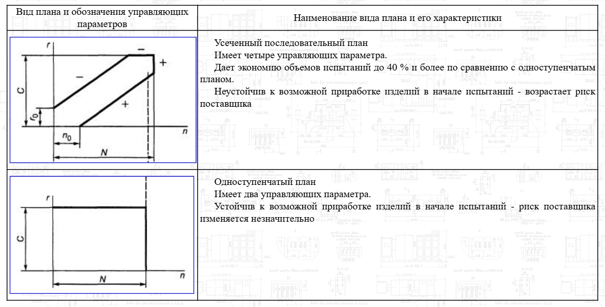

# 25. Планы испытаний и их трактовка. Задачи выбора плана испытаний

## Планы испытаний и их трактовка

- План [`NUT`] – план испытаний, согласно которому одновременно испытывается N
  объектов, отказавшие во время испытаний объекты не восстанавливают (U) и не
  заменяют. Испытания прекращают по истечении времени или наработки T для каждого
  неотказавшего объекта.
- План [`NUr`] – план испытаний, согласно которому одновременно испытывается N
  объектов, отказавшие во время испытаний объекты не восстанавливают (U) и не
  заменяют, испытания прекращают, когда число отказавших объектов достигло r.
- План [`NUN`] – план испытаний, согласно которому одновременно испытывается N
  объектов, отказавшие во время испытаний объекты не восстанавливают (U) и не
  заменяют. Испытания прекращают, когда число отказавших объектов достигло N, то
  есть, когда отказали все объекты, поставленные на испытания.
- План [`NU(r|T)`] – план испытаний, согласно которому одновременно испытывается N
  объектов, отказавшие во время испытаний объекты не восстанавливают и не заменяют
  (U). Испытания прекращают, когда число отказавших объектов достигло r или по
  истечении времени или наработки T для каждого неотказавшего объекта, в
  зависимости от того, какое из этих условий выполнилось ранее.
- План [`NRT`] – план испытаний, согласно которому одновременно начинают испытания
  N объектов, отказавшие во время испытаний объекты заменяют новыми (R), испытания
  прекращают по истечении времени (наработки) T для каждой из N позиций (T
  исчисляют суммарно по каждому из N стендов).
- План [`NRr`] – план испытаний, согласно которому одновременно начинают испытания
  N объектов, отказавшие во время испытаний объекты заменяют новыми (R), испытания
  прекращают, когда число отказов, суммарное по всем позициям, достигло r.
- План [`NR(r|T)`] – план испытаний, согласно которому одновременно начинают
  испытания N объектов, отказавшие во время испытаний объекты заменяют новыми (R).
  Испытания прекращают, когда или число отказов, суммарное по всем позициям,
  достигло r, или по истечении времени (наработки) T для каждой из N позиций, в
  зависимости от того, какое из этих условий выполнилось ранее.

Значения букв:

- `N__` - количество штук
- `_U_` - испытываемые элементы не заменяются
- `_R_` - испытываемые элементы заменяются
- `__r` - проведение испытаний до поломки r элементов  
- `__T` - проведение испытаний по время истечению времени T
- `__N` - проведение испытаний до поломки всех элементов

## Одноступенчатые и усеченные планы испытаний 

- $r$ - суммарное учитываемое число отказов на данный момент испытаний;
- $r_0$ - точка пересечения границы браковки последовательного плана испытаний с
  осью ординат на графике планов испытаний;
- $с$ - предельное (браковочное) суммарное учитываемое число отказов на данный
  момент испытаний;
- $N$ - максимальное (максимально возможное, допустимое) число наблюдений до
  принятия решения о приемке или браковке;
- $n$ - суммарное число наблюдений на данный момент испытаний;
- $n_0$ - точка пересечения границы приемки последовательного плана испытаний с
  осью абсцисс на графике планов испытаний;

Определяют вид плана испытаний.

Одноступенчатые планы испытаний применяют в том случае, если:

- экономия затрат на проведение испытаний не имеет существенного (решающего)
  значения;
- возможен период приработки изделий в начале испытаний.

Последовательные усеченные планы испытаний применяют в том случае, если:

- экономия затрат на проведение испытаний имеет существенное значение;
- отсутствует период приработки изделий в начале испытаний.

Допускается применять другой план испытаний, если имеется возможность вычислить
его характеристики и установить, что выбранный (найденный) план испытаний
является более предпочтительным.

## Источники

- https://files.stroyinf.ru/Data1/58/58961/#i76044
- https://studfile.net/preview/6318078/page:15/
