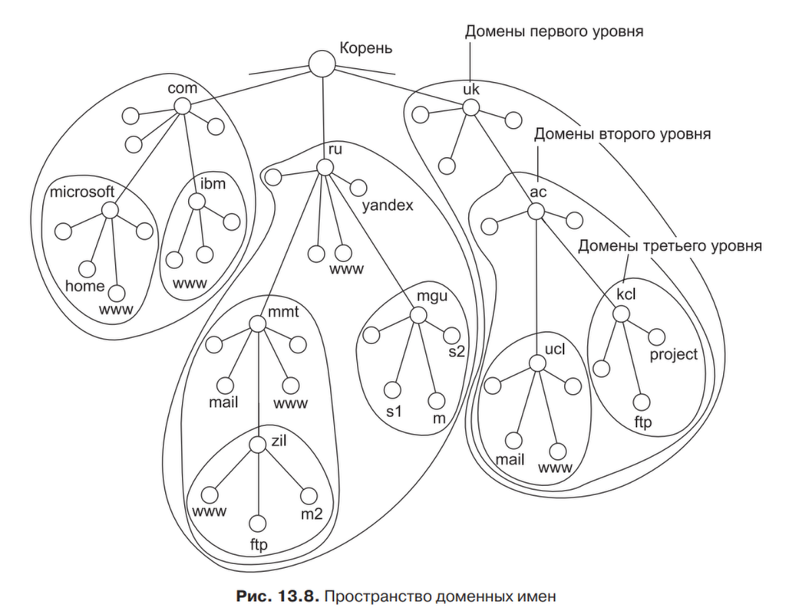

# 10. Плоские и иерархические символьные имена. Система DNS. Организация управления доменными именами Интернета. Схема работы DNS: DNS-клиент, DNS-сервер.

## Плоские и иерархические символьные имена (стр.419)

В локальных сетях исторически использовались **плоские имена** —
последовательности символов, не разделенные на части (например, NW1_1,
MOSCOW_SALES_2). Для их разрешения (сопоставления с адресами) применялись
широковещательные запросы (как в протоколе NetBIOS). Этот подход не
масштабируется для больших сетей, подобных Интернету.

В стеке TCP/IP используется **доменная система имен (DNS)**, которая имеет
**иерархическую древовидную структуру**. Имя состоит из последовательности
частей, разделенных точками (например, `home.microsoft.com`). Запись начинается
с младшей (имя узла) и заканчивается старшей (домен верхнего уровня) частью.
Иерархия аналогична файловой системе, но порядок записи обратный. Это позволяет
распределить административную ответственность за уникальность имен между разными
организациями на разных уровнях.

## Система DNS и организация управления доменными именами (стр. 421)

**Доменная служба имен (DNS)** — это распределенная система, отображающая
*символьные доменные имена на IP-адреса (IPv4/IPv6).

### Организация управления

**Корневой домен** (обозначается точкой `.`) управляется централизованно
  организациями типа **ICANN**.

**Домены верхнего уровня (TLD)** делятся на:
* Национальные (ccTLD): `ru`, `uk`, `us`.
* Общие (gTLD): 
  * коммерческие (`com`)
  * образование (`edu`)
  * некоммерческие (`org`)
  * сетевые (`net`)

Каждый домен администрируется отдельной организацией, которая может
делегировать управление поддоменами (разбивать домен на зоны). Например,
администратор домена `mgu.ru` отвечает за уникальность имен следующего уровня
(`s1.mgu.ru`, `s2.mgu.ru`).

### Иерархическая организация службы DNS

 отражается в структуре серверов:

1. **Корневые DNS-серверы** — вершина иерархии, хранят адреса серверов доменов
   верхнего уровня.
2. **Серверы доменов верхнего уровня (TLD)** — хранят адреса серверов для
   доменов второго уровня (например, для `com` или `ru`).
3. **Авторитативные DNS-серверы** организаций — отвечают за свои зоны (например,
   за `microsoft.com`). Для надежности зону обслуживают **первичный (primary)**
   сервер (с мастер-копией файла зоны) и один или несколько **вторичных
   (secondary)** серверов, которые копируют данные с первичного.

**Схема работы DNS: DNS-клиент и DNS-сервер** (стр.423)

**DNS-клиент (резольвер)** — программа, входящая в ОС. Когда приложению
*(например, браузеру) нужно разрешить имя (например, `example.com`), оно
*обращается к резольверу. Клиенту должен быть известен IP-адрес хотя бы одного

***DNS-сервера** (настраивается вручную или получается через DHCP).

**DNS-сервер** хранит распределенную базу отображений в виде **файлов зоны**.
*Файл зоны содержит записи типов:

- **A** — имя -> IPv4-адрес.
- **AAAA** — имя -> IPv6-адрес.
- **NS** — имя DNS-сервера для домена.
- **MX** — имя почтового сервера для домена.

**Процесс разрешения имени (схема работы):**

1. Клиент отправляет **DNS-серверу** запрос о разрешении доменного имени.
2. Если запрашиваемое имя входит в **зону**, за которую сервер отвечает
   (например, он авторитативен для `example.com`), он дает **полномочный
   (авторитативный) ответ** на основе своего файла зоны.
3. Если имени нет в его зоне, сервер действует как рекурсивный резолвер (если
   так настроен): запрашивает корневые серверы, затем серверы TLD, пока не получит
   адрес авторитативного сервера для нужного домена, от которого и получит
   окончательный ответ. Для ускорения последующих запросов сервер может
   **кэшировать** полученные ответы на время и в будущем давать **неполномочные
   ответы** из кэша.
4. Сервер возвращает ответ клиенту. Большинство запросов/ответов передаются по
   **UDP** (порт 53), но для зонных трансферов (копирования файлов зоны между
   серверами) или больших ответов может использоваться **TCP** (порт 53).
