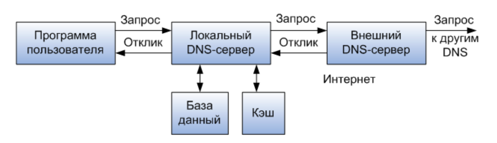
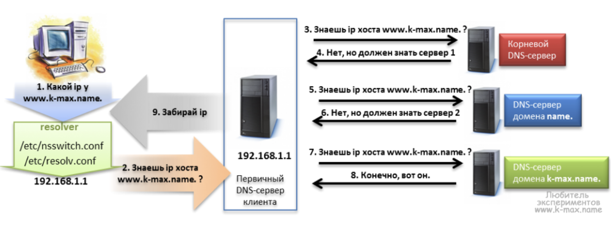

# 11. Процедуры разрешения DNS-имён: непосредственный поиск, опосредованный поиск.

Процедура разрешения DNS-имени во многом аналогична процедуре поиска файловой
системой адреса файла по его символьному имени. Действительно, в обоих случаях
составное имя отражает иерархическую структуру организации соответствующих
справочников — каталогов файлов или DNS-таблиц. Здесь домен и доменный
DNS-сервер являются аналогом каталога файловой системы.

Для определения IP-адреса по доменному имени необходимо просмотреть все
DNS-серверы, обслуживающие цепочку поддоменов, входящих в имя хоста, начиная с
корневого домена.  Существенным отличием файловой системы от службы DNS является
то, что первая расположена на одном компьютере, а вторая по своей природе
является распределенной.  В DNS имеются следующие типы запросов: итеративный (он
же прямой), обратный и рекурсивный.

## Итеративный запрос

**Итеративный** (он же **непосредственный**, прямой, нерекурсивный) запрос
**посылает доменное имя DNS серверу и просит вернуть либо IP адрес этого домена,
*либо имя DNS сервера, авторитативного для этого домена. При этом, сервер DNS не
*опрашивает другие серверы для получения ответа. Так работают корневые и TLD
*серверы.

Процедура разрешения:

1. DNS-клиент обращается к корневому DNS-серверу с указанием полного доменного
   имени.
2. DNS-сервер отвечает клиенту, указывая адрес следующего DNS-сервера,
   обслуживающего домен верхнего уровня, заданный в следующей старшей части
   запрошенного имени.
3. DNS-клиент делает запрос следующего DNS-сервера, который отсылает его к
   DNS-серверу нужного поддомена и т. д., пока не будет найден DNS-сервер, в
   котором хранится соответствие запрошенного имени IP-адресу. Этот сервер дает
   окончательный ответ клиенту.

## Рекурсивный запрос

**Рекурсивный** (он же **опосредованный**) запрос посылает DNS серверу доменное
*имя и просит возвратить IP адрес запрошенного домена. При этом сервер может
*обращаться к другим DNS серверам.

Процедура разрешения:

1. DNS-клиент запрашивает локальный DNS-сервер, то есть тот сервер,
   обслуживающий поддомен, которому принадлежит имя клиента.
2. Далее возможны два варианта действий:
    - если локальный DNS-сервер знает ответ, то он сразу же возвращает его клиенту
      (это может произойти, когда запрошенное имя входит в тот же поддомен, что и
      имя клиента, или когда сервер уже узнавал данное соответствие для другого
      клиента и сохранил его в своем кэше);
    - если локальный сервер не знает ответ, то он выполняет итеративные запросы к
      корневому серверу и т.д. точно так же, как это делал клиент в предыдущем
      варианте, а получив ответ, передает его клиенту, который все это время просто
      ждет его от своего локального DNS-сервера.

## Обратный запрос

**Обратный** запрос посылает IP и просит вернуть доменное имя.

## Источники

- [Система DNS](sources/net_LS-16RU_dns.pdf)
