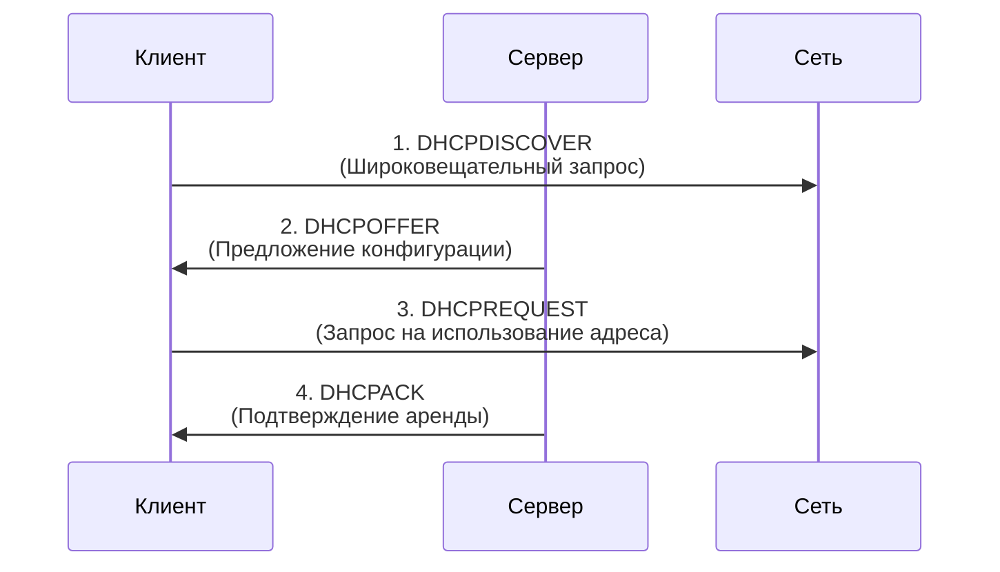

# 15. DHCP-клиент и DHCP-сервер. Расположение DHCP-серверов. Пример обмена сообщения между DHCP-клиентов и DHCP-сервером.

Масленников: 15

DHCP (Dynamic Host Configuration Protocol) — это сетевой протокол, который автоматически назначает IP-адреса и другие параметры конфигурации (например, адрес шлюза или DNS-сервера) устройствам в сети.

## DHCP-клиент и DHCP-сервер

Протокол работает по модели «клиент-сервер»:

* **[DHCP-клиент](https://itelon.ru/blog/dhcp-server/)** — это любое сетевое устройство (компьютер, телефон, принтер), которое запрашивает и получает конфигурацию. Клиент [отправляет](https://selectel.ru/blog/dhcp-protocol/) широковещательные запросы, так как изначально не знает адрес сервера.
* **[DHCP-сервер](https://itelon.ru/blog/dhcp-server/)** — служба, которая хранит пул IP-адресов и другие настройки, а также управляет процессом их выдачи клиентам.

## Расположение DHCP-серверов

Серверы могут располагаться в [разных](https://onskills.ru/blog/kak-rabotaet-dhcp-server-v-lokalnoj-seti/) точках сети в зависимости от её размера и назначения:

* **В домашних и малых офисных сетях** эту роль обычно выполняет **домашний маршрутизатор (роутер)**.
* **В сетях интернет-провайдеров** DHCP-сервер находится в инфраструктуре провайдера (в «серверной» или дата-центре). Для связи с клиентами в разных подсетях используются **агенты-ретрансляторы (DHCP Relay)**, которые устанавливаются на маршрутизаторах.
* **В корпоративных сетях** DHCP развертывается на выделенных серверах (например, на Windows Server или Linux). Для отказоустойчивости может использоваться несколько серверов, а для обслуживания разных сегментов сети (VLAN) также задействуются агенты-ретрансляторы.

## [Пример](https://selectel.ru/blog/dhcp-protocol/) обмена сообщениями (Процесс DORA)

Основной процесс получения IP-адреса включает четыре этапа, известных под аббревиатурой **DORA**: Discovery, Offer, Request, Acknowledgement.

Подробное описание каждого этапа:

1. **DHCPDISCOVER (Обнаружение)**. Клиент, не имея IP-адреса (источник `0.0.0.0`), отправляет широковещательное сообщение на адрес `255.255.255.255`, чтобы найти доступные DHCP-серверы.
2. **DHCPOFFER (Предложение)**. Получив запрос, сервер резервирует адрес из своего пула и отправляет ответ. В сообщении содержится предлагаемый адрес (`yiaddr`), а также маска подсети, шлюз и срок аренды.
3. **DHCPREQUEST (Запрос)**. Клиент, который может получить несколько предложений, выбирает одно и отправляет новый широковещательный запрос, указывая ID выбранного сервера. Это уведомляет выбранный сервер о согласии, а остальные — об отказе.
4. **DHCPACK (Подтверждение)**. Выбранный сервер окончательно подтверждает аренду, отправляя клиенту сообщение `DHCPACK` с теми же параметрами. После этого клиент может начать использовать IP-адрес.

Если сервер не может удовлетворить запрос (например, адрес уже занят), он отправляет сообщение **`DHCPNAK`**, после чего клиент начинает процесс заново.

## Другие типы сообщений

Помимо основных, протокол DHCP использует и другие типы сообщений, основные из которых приведены в таблице:

| Тип сообщения | Отправитель | Назначение |
| :--- | :--- | :--- |
| **DHCPRELEASE** | Клиент | Досрочное освобождение IP-адреса (окончание аренды). |
| **DHCPDECLINE** | Клиент | Уведомление сервера о том, что предложенный адрес уже используется в сети. |
| **DHCPINFORM** | Клиент | Запрос локальных параметров (например, адреса DNS), когда IP-адрес у клиента уже есть. |

Этот четырехэтапный процесс (DORA) обеспечивает автоматическое и бесконфликтное назначение IP-адресов в самых разных сетях — от домашних до корпоративных.
