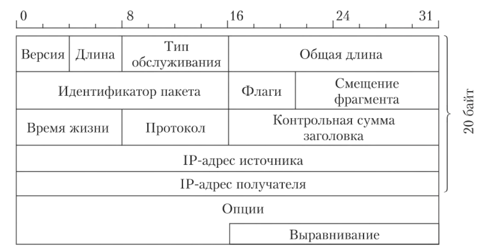
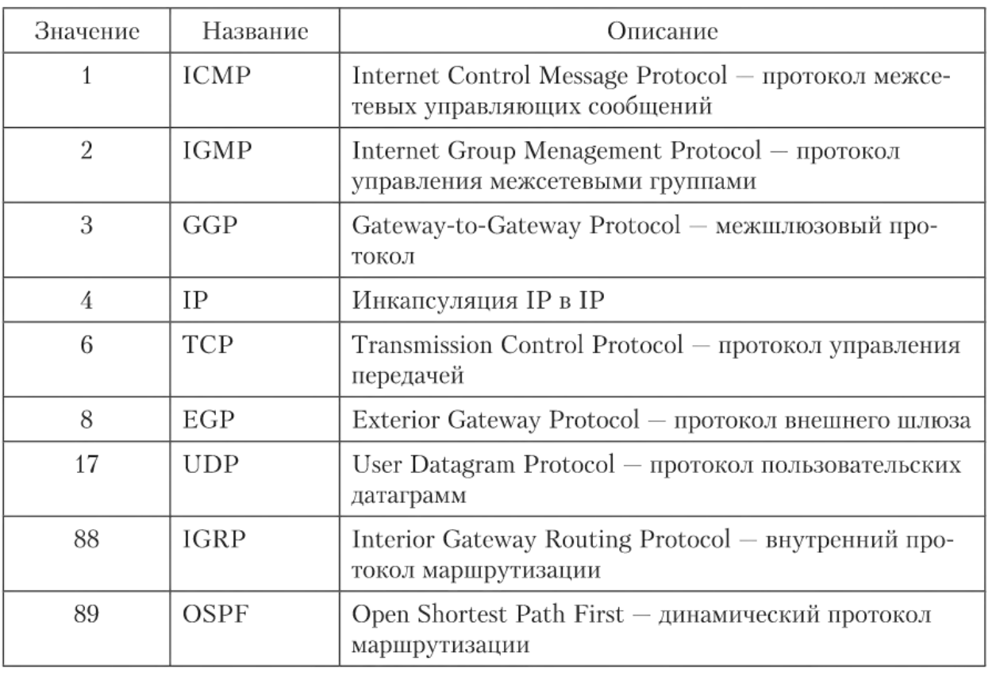

# 16. Общая характеристика протокола IP: назначение, обеспечение надёжности. Формат IPv4-пакета: номер версии, длина заголовка, тип сервиса, общая длина, идентификатор пакета, флаги, смещение фрагмента, время жизни, протокол верхнего уровня, контрольная сумма заголовка, IP-адрес источника, IP-адрес приёмника, параметры, выравнивание.

Первоначальное назначение этого протокола - передача пакетов в гетерогенных
(составных) сетях со сложной топологией. Он не гарантирует доставку данных до
узла назначения, т.е. является датаграммным протоколом.

Пакет протокола IP имеет заголовок длиной до 20 байт и поле данных.

## Поля заголовка

### Номер версии (4 бит)

Версия протокола IP.

### Длина заголовка (4 бит)

Размер заголовка в 32-битных словах.

### Тип сервиса (8 бит)

Он же тип обслуживания - имеет несколько подполей:
- Приоритет (Precedence), длина которого 3 бита: указывается значение приоритета
  передаваемых данных отсамого низкого - 0 (обычный пакет) до самого 
  высокого - 7 (пакет с управляющей информацией). В первую очередь
  обрабатываются пакеты более высокого приоритета.
- D (1 бит) - Низкая задержка.
- T (1 бит) - Высокая пропускная способность.
- R (1 бит) - Высокая надёжность.
- C (1 бит) - Низкая стоимость.
- Последний бит не используется

### Общая длина (16 бит)

Общий размер пакета в байтах.

### Идентификатор пакета (16 бит)

этот номер увеличивается каждый раз на 1 при очередной посылке пакета, за
исключением пересылки фрагментированных IP-пакетов, в которых значение в данном
поле одинаковое для всех фрагментов.

### Флаги (3 бит)

1. Зарезервирован.
2. Не фрагментировать: запрещает маршрутизатору разбивать пакет на части.
3. Есть еще фрагменты: указывает, что есть ещё пакеты.

### Смещение сегмента (13 бит)

на сколько байт поле данных смещено от начала исходного фрагментирующегося
пакета. Смещение должно быть кратным 8 байтам.

### Время жизни (8 бит) 

(Time to Live, TTL) - задан максимальный срок нахождения пакета в сети.
Уменьшение значения этого поля происходит или каждую секунду, или при
прохождении пакета через промежуточный маршрутизатор.

### Протокол (8 бит)

Содержит идентификатор протокола верхнего уровня,которому принадлежит
информация, содержащаяся в поле данных пакета. Значения идентификаторов для
различных протоколов приведены в RFC "Assigned Numbers".

### Контрольная сумма (16 бит)

Значение контрольной суммы рассчитывается без учета поля данных,
т.е. только по заголовку IP-пакета, и размещается в поле Контрольная
сумма (Header Checksum) длиной 2 байта. Значение этого поля пересчитывается при
прохождении промежуточных узлов на маршруте движения IP-пакета, так как значение
некоторых полей его заголовка может меняться при движении пакета по сети. В
процессе вычисления контрольной суммы значение самого поля Контрольная сумма
обнуляется.

### Адреса источника и приёмника (32 + 32 бит)

Адреса отправителя и получател я размещаются в соответствующих полях IP-адрес
источника (Source IP Address) и IP-адрес назначения (Destination IP Address).

## Опции (переменный размер)

Необязательное, но может использоваться во время отладки. Поле имеет несколько
подполей с предопределенными типами. Число подполей может меняться, поэтому
после поля Опции может быть поле выравнивание.

## Выравнивание

Выравнивание (Padding), предназначен для выравнивания нулями заголовка по
32-битной границе.

## Источники

- [ЛЗ 05](sources/ЛЗ_05.pdf)
